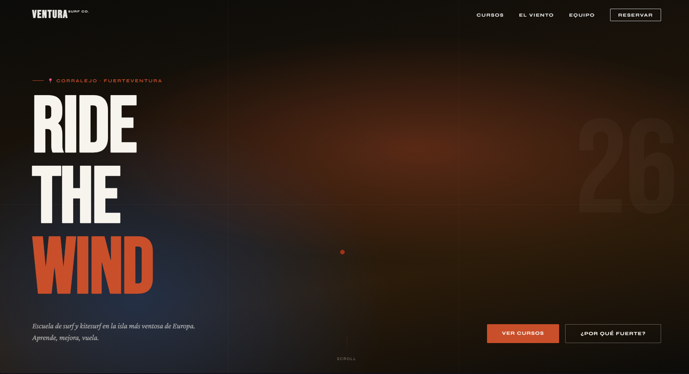

# 🏄‍♀️💙 Ventura Surf Co. – Premium Landing Page

[](https://lna005.github.io/ventura-surf-co/)
[](#)
[](#)
[](#)

**Ventura Surf Co.** es una landing page de alto rendimiento diseñada para una escuela de deportes acuáticos en Fuerteventura 🌊. El proyecto combina una estética editorial moderna con optimizaciones técnicas de nivel profesional — y mucho amor por el océano. 🐚✨

🌐 **Demo en vivo →** [lna005.github.io/ventura-surf-co](https://lna005.github.io/ventura-surf-co/)

---

## 📸 Vista previa



---

## ✨ Características Principales

### 💎 Diseño y Experiencia de Usuario (UX)
- 🖱️ **Cursor Personalizado Suave** — Implementado con `requestAnimationFrame` para una navegación fluida y orgánica.
- 🎨 **Diseño Editorial** — Tipografías contrastadas (`Bebas Neue`, `Syne`, `Crimson Pro`) y paleta inspirada en el entorno volcánico de Canarias.
- 📱 **Totalmente Responsivo** — Adaptado meticulosamente para móvil, tablet y escritorio.
- 💨 **Interacciones Dinámicas** — Gráficos de viento animados y tickers de texto infinito.

### 🛠️ Especificaciones Técnicas (Performance & SEO)
- ⚡ **Optimización de Animaciones** — Interpolación Lineal (Lerp) en el bucle de animación para reducir el uso de CPU.
- 🔍 **SEO & Open Graph** — Meta Tags completos para indexación óptima y previsualizaciones en redes sociales.
- 📊 **Datos Estructurados (JSON-LD)** — Esquema `Course` e `ItemList` para Rich Snippets en Google.
- ♿ **Accesibilidad (A11y)** — Clases `.sr-only`, etiquetas semánticas y atributos `aria` vinculados correctamente.

### 📩 Funcionalidad de Negocio
- 💌 **Formulario de Reserva Real** — Integración con **Formspree** para captura de leads directo al email, con validaciones nativas de HTML5.

---

## 🛠️ Tecnologías Utilizadas

| Tecnología | Uso |
|-----------|-----|
| HTML5 | Semántica avanzada |
| CSS3 | Custom Properties, Flexbox, Grid, Animaciones |
| JavaScript ES6+ | Intersection Observer API, rAF Animation Loop |
| JSON-LD | SEO Semántico |
| Formspree | Backend del formulario de reserva |

---

## 📦 Instalación y Uso

1. Clona el repositorio:
   ```bash
   git clone https://github.com/LNa005/ventura-surf-co.git
   ```

2. Abre `index.html` en tu navegador (o usa Live Server en VS Code 🤍).

3. Para que el formulario funcione, cambia el ID en el `action` del `<form>` por tu propio ID de Formspree:
   ```html
   <form action="https://formspree.io/f/TU_ID_AQUI" method="POST">
   ```

---

## 🗂️ Estructura del proyecto

```
ventura-surf-co/
├── index.html          # Página principal
├── kitesurf.html       # Detalle curso kitesurf
├── surf.html           # Detalle curso surf
├── windsurf.html       # Detalle curso windsurf
├── sup.html            # Detalle curso SUP & yoga
├── privada.html        # Detalle clase privada
├── privacy.html        # Política de privacidad (RGPD)
├── favicon.svg         # Favicon con identidad de marca
├── .gitignore
├── img/
│   ├── hero.webp       # Fondo del hero (vista aérea kitesurf)
│   ├── kitesurf.webp   # Card kitesurf destacada
│   ├── surf.webp       # Card surf intensivo
│   ├── windsurf.webp   # Card windsurf
│   ├── sup.webp        # Card SUP & yoga
│   └── privada.webp    # Card clase privada
└── assets/
    └── preview.png     # Screenshot para el README
```

---

## 📋 Pendientes / TODO List 🩵

> Todo lo que queda por pulir para que esto esté *chef's kiss* ✨

### 🔴 Urgente (antes de compartir como portfolio)

- [x] 🔗 **Enlazar redes en el footer** — Sustituido Instagram/WhatsApp por GitHub y LinkedIn
- [x] 📄 **Crear página de Política de Privacidad** — `privacy.html` creada y enlazada en el footer
- [x] 🖼️ **Screenshot en el README** — Captura real añadida arriba ✨

### 🟡 Mejoras de contenido

- [x] 📸 **Imágenes propias** — Sustituidas todas las imágenes de Unsplash por assets generados propios (`img/`)
- [x] ⭐ **Sección de testimonios** — 3 reseñas de alumnos con nombre, curso y valoración
- [x] 🎒 **Páginas de detalle de cada curso** — 5 páginas individuales con programa, incluye y sidebar de reserva
- [ ] 🌍 **Versión en inglés / alemán** — El target turístico habla otros idiomas (Tom el instructor lo hace 😄)

### 🟢 Pulido técnico

- [x] 🏷️ **Favicon añadido** — `favicon.svg` con la V de marca y ola decorativa
- [x] 📱 **Menú hamburguesa móvil** — Overlay a pantalla completa con animación y cierre automático
- [x] 🖼️ **Imágenes optimizadas a `.webp`** — Todas las imágenes convertidas para mejor rendimiento
- [x] 🔒 **Honeypot anti-spam** — Campo oculto `_gotcha` en el formulario para bloquear bots
- [x] 🧪 **Formulario de Formspree testeado** — Reserva de prueba enviada y recibida correctamente
- [ ] 🎭 **Animaciones de entrada con scroll** — Extender el Intersection Observer para que todas las secciones aparezcan con fade al entrar en viewport
- [ ] 💀 **Skeleton loading** — Placeholders animados mientras cargan las imágenes
- [ ] 🔦 **Lighthouse score 90+** — Ejecutar auditoría en Chrome DevTools y añadir captura al README
- [ ] 🖼️ **Meta og:image real** — Cambiar el placeholder `tu-dominio.com` por la URL real de GitHub Pages
- [ ] 🔗 **LinkedIn real** — Actualizar `href="#"` con la URL del perfil cuando esté creado
- [ ] 📱 **Revisar en iOS Safari** — Algunos efectos CSS se comportan diferente en iPhone

### 📄 Calidad de código

- [ ] 💬 **JSDoc en funciones JS** — Añadir documentación a `animateCursor()` y el Intersection Observer
- [ ] 📝 **CHANGELOG.md** — Registrar los cambios por versión siguiendo el estándar [Keep a Changelog](https://keepachangelog.com/es/)

### 💅 Nice to have (futuro)

- [ ] 🌍 **Versión en inglés / alemán** — El target turístico habla otros idiomas (Tom el instructor lo hace 😄)
- [ ] 🗓️ **Calendario de disponibilidad** — Integrar Calendly o similar para que los usuarios vean fechas disponibles
- [ ] 🌤️ **Widget de viento en tiempo real** — API de Windguru o Windy para mostrar las condiciones actuales de la playa
- [ ] 🖼️ **Galería de fotos** — Un lightbox con imágenes reales de las clases
- [ ] 💳 **Pago online** — Integrar Stripe para que las reservas se puedan confirmar con pago directo
- [ ] 📧 **Email de confirmación automático** — Con Formspree Pro o una función serverless (Netlify Functions)

---

## 👩‍💻 Autora

**Elena** 💙  
Hecho con ❤️ en Canarias 🌋🌊